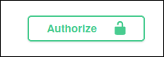
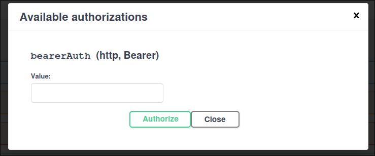

# GS - Protech The Future | Java

## Integrantes

| Nome                   |   RM   |
| :--------------------- | :----: |
| Otavio Miklos Nogueira | 554513 |
| Luciayla Yumi Kawakami | 557987 |

---

## Links

- Github: https://github.com/omininola/gs_java
- Deploy: https://gs-java-g2va.onrender.com/swagger-ui/index.html
- Apresentação: 
- Pitch: 

---

## Descrição 

Desenvolvemos um aplicativo mobile em React Native voltado para o relato e monitoramento de incêndios e queimadas. O sistema permite que usuários façam cadastro, login e publiquem relatórios de ocorrências, com possibilidade de filtrar por cidade ou visualizar apenas seus próprios relatos.

Além disso, o app conta com um dashboard em tempo real, alimentado por dados do ThingSpeak, onde gráficos mostram informações captadas por sensores embarcados em drones que sobrevoam áreas críticas. Esses drones são capazes de gerar relatórios automáticos, otimizando a identificação e resposta a desastres ambientais.

A aplicação consome uma REST API desenvolvida com Spring Boot, que se comunica com um banco de dados Oracle contendo tabelas interligadas como: Usuários, Relatórios, Drones, Sensores, Cidades, Estados e Países.

Combinando dados manuais e automáticos, o sistema visa acelerar a detecção de incêndios e fornecer informações valiosas para tomada de decisão por autoridades e cidadãos.

---

## Testes

**Caso queira diretamente pelo deploy acesse: https://gs-java-g2va.onrender.com/swagger-ui/index.html**

E siga a partir de [Spring Security + JWT](#spring-security--jwt)

### Inicialização local

1. Clone esse repositório: `git clone https://github.com/omininola/gs_java`
2. Entre na pasta do projeto: `cd gs_java`
3. Build o projeto utilizando o Maven: `./mvnw package`
4. Rode o jar buildado: `java -jar target/api_gs-0.0.1-SNAPSHOT.jar`
5. Vá até a URL: http://localhost:8080/swagger-ui/index.html

### Spring Security + JWT

Por padrão todas as rotas precisam de autenticação para serem acessadas

Dica importante: faça um usuário com a `role: "ADMIN"`, assim você tera acesso a todos os endpoints quando o seu token for gerado

Você pode gerar um token pela rota [/usuarios/register](http://localhost:8080/swagger-ui/index.html#/usuario-controller/createUsuario)
Ou resgatar um token (caso já tenha um conta para logar) pela rota [/usuarios/login](http://localhost:8080/swagger-ui/index.html#/usuario-controller/loginUsuario)

Com o token em mãos, você pode clicar no botão verde e colar o seu token:

Depois disso você pode explorar todos os endpoints da nossa API

## Endpoints

Caso queira testas nossos endpoints pelo Postman ou outra aplicação, nossa documentação em formato JSON está aqui:
[endpoints.json](docs/endpoints.json)